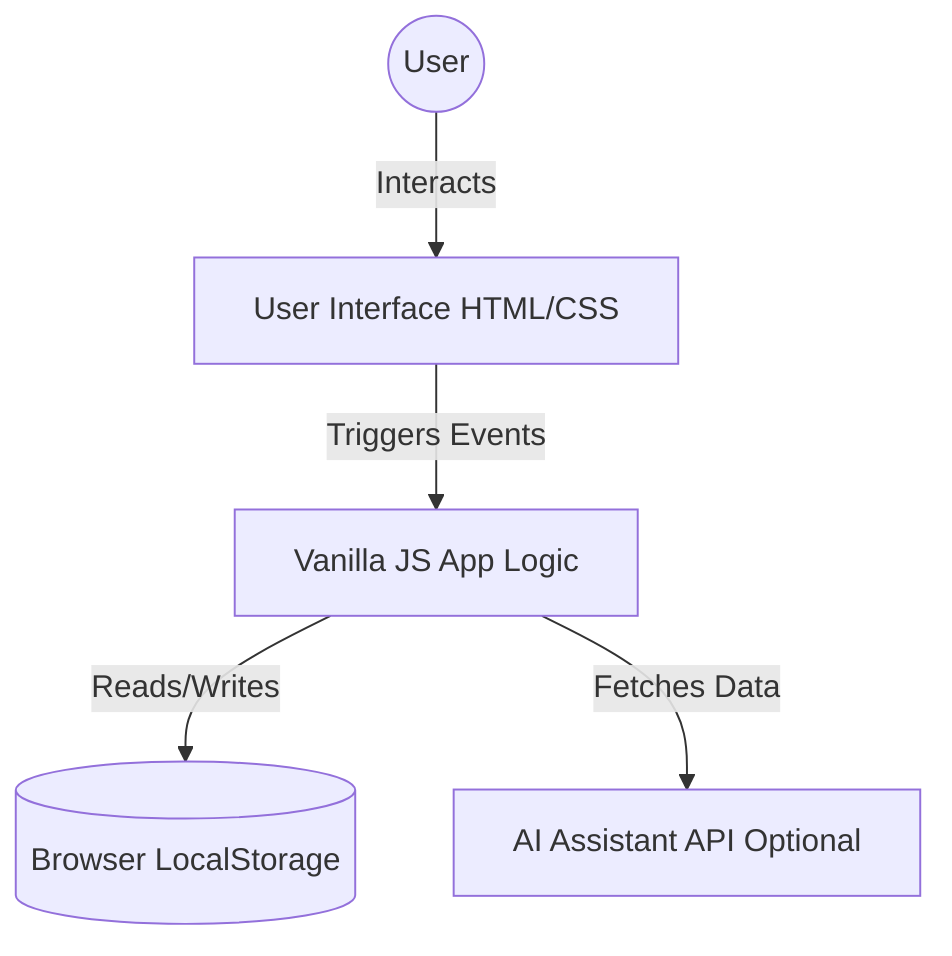

# 📚 StudyFlow

> Your ultimate, privacy-first study operating system built for modern students and lifelong learners.

StudyFlow is a comprehensive Study Planner and Dashboard tailored for students and developers. It is built entirely using HTML, CSS, and Vanilla JavaScript, requiring zero dependencies, build steps, or backend servers to run. All data is persisted locally in your browser using `localStorage`.


## 🌐 Live Demo

🔗 **[StudyFlow Live Demo](https://pruthviraj-patil20.github.io/Study-Planner/)**

---

## 📑 Table of Contents
- [Key Features](#-key-features)
- [Architecture](#-architecture)
- [Tech Stack](#-tech-stack)
- [Project Structure](#-project-structure)
- [Getting Started](#-getting-started)
- [Deployment](#-deployment)
- [Usage](#-usage)
- [Contributing](#-contributing)

---

## ✨ Key Features

| Feature | Description |
|---------|-------------|
| **📊 Dashboard** | Quick glance at study hours, completed tasks, upcoming exams, and overall progress. |
| **📅 Planner** | A detailed weekly & daily calendar view to schedule and manage study sessions. |
| **✅ Kanban Tasks** | Interactive board with drag-and-drop support (To Do, In Progress, Done). |
| **⏱️ Focus Timer** | Built-in Pomodoro timer with circular progress indicators for deep work. |
| **🤖 AI Assistant** | Get smart recommendations and help with your study plan. |
| **📝 Notes & Exams** | Keep track of your quick notes, summaries, and upcoming examinations. |
| **🎨 Theming** | Fully responsive. Includes Light, Dark, and a special Rainbow mode! |

---

## 🏗 Architecture

StudyFlow is a completely client-side application. Here is how the data flows:



---

## 🛠 Tech Stack

- **HTML5:** Clean, semantic HTML structure.
- **CSS3:** Custom styles, CSS variables for theming, CSS Grid & Flexbox layouts.
- **Vanilla JavaScript:** DOM manipulation, drag-and-drop API, local storage data management, and state logic without any external libraries.

---

## 📂 Project Structure

```text
Study-Planner/
├── index.html          # Dashboard entry point
├── planner.html        # Weekly/Daily calendar
├── tasks.html          # Kanban board
├── focus.html          # Pomodoro timer
├── css/                # Stylesheets (layout, theme, responsive)
├── js/                 # Application logic (app.js, storage.js, etc.)
└── assets/             # Images and icons
```

---

## 🚀 Getting Started

Since StudyFlow is a completely static, client-side application, there is no complex setup or installation required!

1. **Clone the repository:**
   ```bash
   git clone https://github.com/Pruthviraj-patil20/Study-Planner.git
   ```
2. **Navigate to the project directory:**
   ```bash
   cd Study-Planner
   ```
3. **Environment Setup (Optional for AI features):**
   Copy `.env.example` to `.env` and add your API keys if you wish to use the AI Assistant locally.
4. **Open it in your browser:**
   - On macOS: `open index.html`
   - On Windows: `start index.html`
   - Or simply double-click the `index.html` file in your file explorer.

---

## ☁️ Deployment

StudyFlow is configured to be easily deployed on modern platforms:
- **Vercel:** Just import the repository and deploy (`vercel.json` included).
- **Netlify:** Ready to go out of the box (`netlify.toml` included).

---

## 💡 Usage

- **Add a Task:** Navigate to the Tasks page and use the Kanban board to create new tasks, assign them to subjects, and set their priority. Drag and drop them as you make progress.
- **Start a Focus Session:** Go to the Focus page to use the Pomodoro timer.
- **Plan your Week:** Use the Planner to block out times for specific subjects. Click on any time block to edit it.
- **Ask the AI:** Click on the AI Assistant to get study tips and schedule optimization.

---

## 🤝 Contributing

Contributions are welcome! Please feel free to submit a Pull Request.

1. Fork the repository
2. Create your feature branch (`git checkout -b feature/AmazingFeature`)
3. Commit your changes (`git commit -m 'Add some AmazingFeature'`)
4. Push to the branch (`git push origin feature/AmazingFeature`)
5. Open a Pull Request

---

## 📄 License

This project is licensed under the MIT License.
